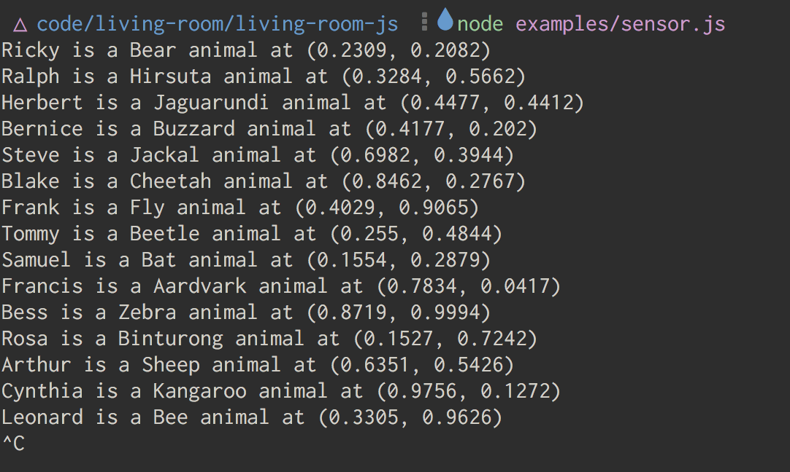

# living-room/lovelace

All the code running in lovelace

Check out the `src/` folder to see what is running on crosby, and being output through the projectors in lovelace.

Try these cool commands:

    npm run room:assert '<yournamehere> is a human animal at (0.5, 0.5)'

    npm run room:select '\$who is a \$species animal at (\$, \$)'

Or maybe

    node src/util/sensor.js

We have a drawing api

    draw text "the devils lettuce" at (0.5, 0.5)

    draw label freebelflorp at (0.1, 0.2)
