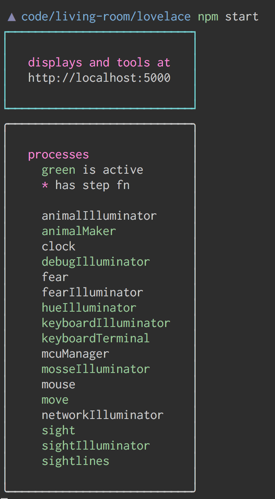

Living Room is a programmable space at Recurse Center. Think of it as a protocol that can be used to create collaborative games, experiments in physical computing, magical real-world data visualizations and just about anything else you can think of.

> If you are at RC, you can view [the whiteboard][], [the table][], or a list of [live facts][]

Feel free to skip to the section most relevant to you
- [introduction](#introduction)
- [getting started](#getting-started)
- [philosophy](#development-philosophy)


# introduction

> At any given moment, Living Room’s coherence is defined only by the communication and collaboration of the people who are programming the space.

To start hacking the room, there are just two concepts to understand: *FACTS* and *PROCESSES*.

## FACTS

Let’s talk about facts first.  At the center of our universe is a [database][database-js] of strings.  We call these strings facts.  A fact can be any length and it can contain any information that you’d like.  A fact is basically just a sentence.  It’s a collection of words intended to express an idea.

Anyone can add a fact to the database.  When you add a fact to the database, we call that an ASSERTION.

Anyone can also delete any fact from the database.  When you delete a fact from the database, we call that a RETRACTION.

What’s more, anyone is allowed to search for a fact in the database.  When you search the database for a fact, we call that a SELECT.

Here are some example assertions:

```js
assert('noah is a person at recurse center')
assert('whiskers is a cat at (0.51, 0.40)')
assert('socks is a cat at (0.72, 0.11)')
assert('there is a mouse at (0.20, 0.85)')
assert('whiskers is hungry')
```

Maybe you're wondering:  What are those numbers in parentheses, like (0.51, 0.40)?  Good question.  They're normalized screen coordinates, because facts often describe something that we'd like to output to a projected screen in the room.

Here are some example retractions:

```js
retract('noah is a person at recurse center')
retract('whiskers is a cat at (0.51, 0.40)')
retract('socks is a cat at (0.72, 0.11)')
retract('there is a mouse at (0.20, 0.85)')
retract('whiskers is hungry')
```

Performing a select is just a bit more complicated.  Selecting on a string will return all facts in the database that match it, like so:

```js
select('noah is a person at recurse center')
```

But you can also use variables to match on any word at a given position in a fact and bind the resultant values in the return object:

```js
select('$personName is a person at recurse center') // might return { personName: "noah" }
select('$animalName is a $animalType at ($x, $y)')  // might return { animalName: "whiskers", animalType: "cat", x: 0.51, y: 0.40 }
select('$who is hungry')                            // might return { who: "whiskers" }
```

And there's one more tool at your disposal:  The wildcard. Like a variable, the wildcard will match on any word at a given position, but it will not bind the word's value in the return object.  To insert a wildcard, just use the $ symbol:

```js
select('$ is a $ at $')
select('$ is a $animalType at ($, $)')
select('$ is $feeling')
```

So that's FACTS.

Now let's move on to the other half of our universe:

## PROCESSES

Processes are programs that consume facts and do things with them.  Processes often perform some small transformation on a fact, or control some behavior of an element in a fact, or use information contained within a fact to do something cool.  Consider the following hypothetical processes:

- at-recursecenter.js is a process that continuously searches the database for people who are at Recurse Center, and upon learning that a new person has arrived at Recurse Center, loudly welcomes them using speech synthesis.

- mouse-process.js is a process that continuously searches the database for mouse animals and moves them a random distance from their previous screen coordinates.

- hungry-cat-process.js is a process that continuously searches the database for cat animals who are hungry, and moves them toward the location of any known mouse animals in the database.

- cat-and-mouse-process.js is a process that continuously searches the database for cat and mouse animals that are located at normalized screen coordinates, and draws them to an HTML canvas, which we project onto the wall.

# getting started

There are two ways to get started with the living room - the first is locally, the second is if you are in lovelace.

Once you have [node.js](nodejs.org), install the dependencies

    npm install

Now there are two ways to interact with the room

- for local development run `npm start`
- for talking in lovelace, `export LIVING_ROOM_HOST=http://crosby.cluster.recurse.com:3000`

You can also check out [what facts exist on crosby][live facts], or [load up the displays or tools][displays]

## speaking with the room

In this folder we have some npm scripts to play with the room

Try these cool commands

    npm run assert '<yournamehere> is a human animal at (0.5, 0.5)'

Woah! `yournamehere` showed up on the table display! What other animals are there?

    npm run select '\$who is a \$species animal at (\$, \$)'

We encourage you to dig around `src/processes` to see what kind of facts are being asserted,
and how things react to facts.

We have a drawing api

    draw text "the devils lettuce" at (0.5, 0.5)

    draw label freebelflorp at (0.1, 0.2)

Which supports drawing to either display

    table: draw text "i am a table!" at (0.14, 0.15)

    whiteboard: draw a (255, 0, 255) circle at (0.5, 0.5) with radius 20

# getting involved

There are a few more things to understand, but the best way to learn is to come hack with us!  Here are just a few ways that you can get involved:

- Write a process that contributes logic to a group game
- Work on infrastructure optimizations
- Get a friend together, to make a game!
- Become a networked sensor and assert the output of your RC project to our database
- Think of cool things to do with the space
- Read and contribute to our [research blog](https://livingroomresearch.tumblr.com/) which has more context

If you are interested in hacking *right now* feel free to `git clone http://github.com/living-room/client-js` and follow the readme there.

Also we would love to chat and pair so just tap on @**Jonathan Dahan (S'14)**, @**Noah Levenson (SP1'18)**, or @**Ana Malagon (SP1'18)**'s shoulders. A good time to start hacking is 12:30pm every friday in Lovelace, where we go over [the state of the room](https://www.recurse.com/calendar/2005) - introducing it to new people, and going over the work.

## helping out

For helping out please see [our github issues](https://github.com/living-room/living-room/issues). We have tagged issues with broad tracks of development:

**[persisting][]** - making the system run and deploy as painless as possible

**[involving][]** - providing a clear entry point for anyone who wants to play in this space

**[playing][]** - writing new sensors, toys, and tools within a space, and

**[exploring][]** - trying out projects, reading papers, watching talks, researching work that could help inform the future of the project.

# development philosophy

Writing the philosophy is to help provide context about decisions made, not to be a set of rules that must be followed. Everything about it can be changed, and we welcome feelings, opinions, and discussion.

**describe the current state of things**

> aspirations become out-of-date quickly, and can be captured in github issues, discussions, etc

**examples are friendlier than documentation**

> examples can be verified easily, and invite exploration

**human readable over machine readable**

> we are focused on exploration of concepts and inviting contributors over performance

**as little code as possible**

> the code that works the best does the least

**support implementations, then transports, then protocols, then languages, then platforms**

> this gets us to the meat of doing interesting things first, then supporting the widest range of sensors and platforms as possible. For example, javascript in memory in the browser, then javascript over http in the browser, then rest over http, then a javascript rest client.

**when implementing protocol/platform support, native is better than consistent**
> for example, using osc channels (`/assert 'today is a beautiful day'`) interoperates with osc libraries better than `/room {assert: {facts: ['today is a beautiful day']}}`, since they don't require json support.

# implementations

If an implementation has no link, it means we would like to support it but haven't written anything yet!

* languages: **[javascript client][client-js]**, c
* protocols: **[http, osc, and socketio service][service-js]**
* platforms: **[browser & node.js client][client-js]**, arduino, openFrameworks, clojure
* visualizers: **[subscription vis](https://github.com/modernserf/rumor-visualizer)**

# inspirations

- realtalk
- roomdb
- datalog
- linda
- [vpri](http://www.vpri.org)


[displays]: http://crosby.cluster.recurse.com:5000/displays/
[the whiteboard]: http://crosby.cluster.recurse.com:5000/displays/whiteboard
[the table]: http://crosby.cluster.recurse.com:5000/displays/whiteboard
[live facts]: http://crosby.cluster.recurse.com:5000/tools/facts

[service-js]: https://github.com/living-room/service-js
[client-js]: https://github.com/living-room/client-js
[database-js]: https://github.com/living-room/database-js

[involving]: https://github.com/living-room/living-room/issues?q=is%3Aopen+is%3Aissue+label%3Ainvolving/
[persisting]: https://github.com/living-room/living-room/issues?q=is%3Aopen+is%3Aissue+label%3Apersisting/
[playing]: https://github.com/living-room/living-room/issues?q=is%3Aopen+is%3Aissue+label%3Aplaying/
[exploring]: https://github.com/living-room/living-room/issues?q=is%3Aopen+is%3Aissue+label%3Aexploring/
